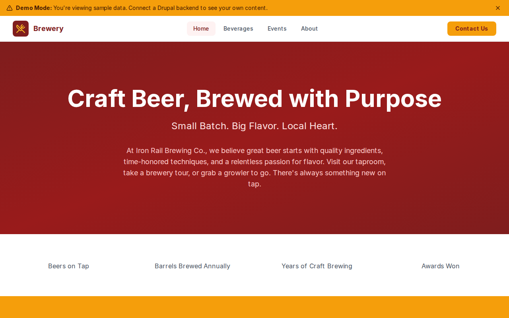

# Decoupled Brewery

A craft brewery and taproom website starter template for Decoupled Drupal + Next.js. Built for microbreweries, brewpubs, taprooms, and craft beer businesses.



## Features

- **Beverages** - Showcase beers on tap with style, ABV, IBU, tasting notes, availability, and pricing
- **Events** - Promote tastings, live music, food pairings, brewery tours, release parties, and trivia nights
- **Brewery Tours** - Static pages for tour scheduling, private group bookings, and visitor information
- **Modern Design** - Clean, accessible UI optimized for brewery and taproom content

## Quick Start

### 1. Clone the template

```bash
npx degit nextagencyio/decoupled-brewery my-brewery
cd my-brewery
npm install
```

### 2. Run interactive setup

```bash
npm run setup
```

This interactive script will:
- Authenticate with Decoupled.io (opens browser)
- Create a new Drupal space
- Wait for provisioning (~90 seconds)
- Configure your `.env.local` file
- Import sample content

### 3. Start development

```bash
npm run dev
```

Visit [http://localhost:3000](http://localhost:3000)

---

## Manual Setup

If you prefer to run each step manually:

<details>
<summary>Click to expand manual setup steps</summary>

### Authenticate with Decoupled.io

```bash
npx decoupled-cli@latest auth login
```

### Create a Drupal space

```bash
npx decoupled-cli@latest spaces create "My Brewery"
```

Note the space ID returned. Wait ~90 seconds for provisioning.

### Configure environment

```bash
npx decoupled-cli@latest spaces env 1234 --write .env.local
```

### Import content

```bash
npm run setup-content
```

This imports:
- Homepage with hero, stats (24 beers on tap, 5,000+ barrels brewed annually, 12 years of craft brewing, 35+ awards won), and taproom CTA
- 4 beverages: Iron Rail IPA, Midnight Stout, Golden Rail Lager, Summer Haze Hefeweizen
- 3 events: National IPA Day Celebration, Taproom Trivia Night, Brewmaster's Dinner: Spring Edition
- 2 static pages: About Iron Rail Brewing Co., Brewery Tours

</details>

## Content Types

### Beverage
- **beverage_type**: Type taxonomy (IPA, Stout, Lager, Wheat, Sour, Pilsner, Porter, Seasonal)
- **style**: Beer style (e.g., "West Coast IPA", "American Stout")
- **abv**: Alcohol by volume percentage
- **ibu**: International Bitterness Units
- **tasting_notes**: Flavor descriptors (e.g., "Tropical fruit", "Pine", "Dark chocolate")
- **availability**: When the beer is available (Year-round, Seasonal)
- **price_pint**: Price per pint
- **image**: Photo of the beverage

### Event
- **event_date**: Event start date and time
- **end_date**: Event end date and time
- **venue_location**: Where the event takes place within the brewery
- **event_category**: Category taxonomy (Tasting, Live Music, Food Pairing, Tour, Release Party, Trivia Night)
- **ticket_price**: Admission cost or pricing details
- **image**: Event promotional image

### Homepage
- **hero_title**: Main headline (e.g., "Craft Beer, Brewed with Purpose")
- **hero_subtitle**: Tagline (e.g., "Small Batch. Big Flavor. Local Heart.")
- **hero_description**: Welcome message
- **stats_items**: Key statistics (beers on tap, barrels brewed, years, awards)
- **featured_beverages_title**: Section heading for what's on tap
- **cta_title / cta_description**: Taproom visit call-to-action block

### Basic Page
- General-purpose static content pages (About, Tours, etc.)

## Customization

### Colors & Branding
Edit `tailwind.config.js` to customize colors, fonts, and spacing.

### Content Structure
Modify `data/brewery-content.json` to add or change content types and sample content.

### Components
React components are in `app/components/`. Update them to match your design needs.

## Demo Mode

Demo mode allows you to showcase the application without connecting to a Drupal backend.

### Enable Demo Mode

```bash
NEXT_PUBLIC_DEMO_MODE=true
```

### Removing Demo Mode

1. Delete `lib/demo-mode.ts`
2. Delete `data/mock/` directory
3. Delete `app/components/DemoModeBanner.tsx`
4. Remove `DemoModeBanner` from `app/layout.tsx`
5. Remove demo mode checks from `app/api/graphql/route.ts`

## Deployment

### Vercel (Recommended)
[](https://vercel.com/new/clone?repository-url=https://github.com/nextagencyio/decoupled-brewery)

### Other Platforms
Works with any Node.js hosting platform that supports Next.js.

## Documentation

- [Decoupled.io Docs](https://www.decoupled.io/docs)
- [Next.js Documentation](https://nextjs.org/docs)
- [Drupal GraphQL](https://www.decoupled.io/docs/graphql)

## License

MIT
